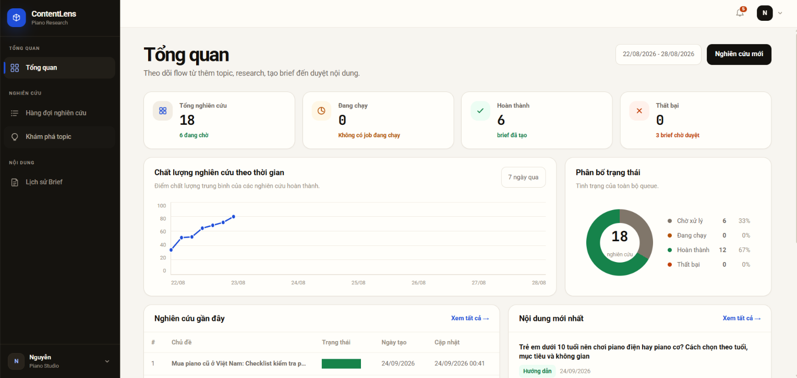
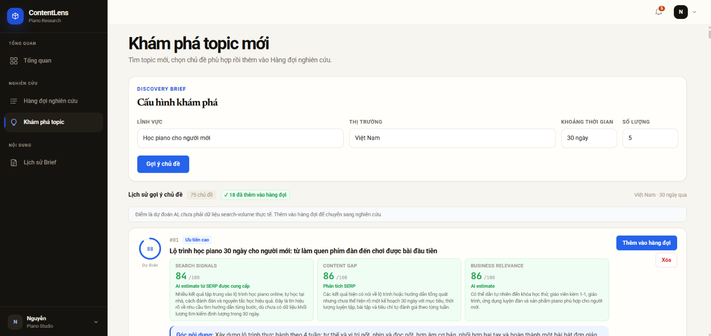
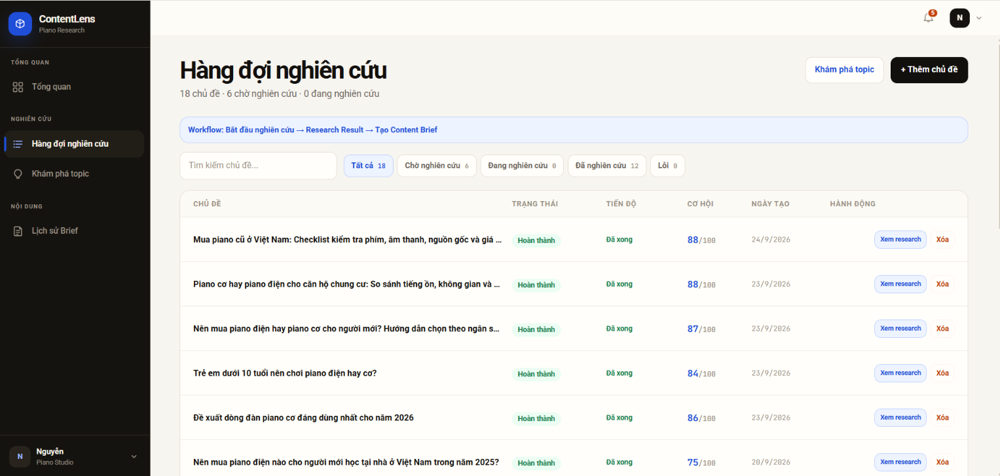
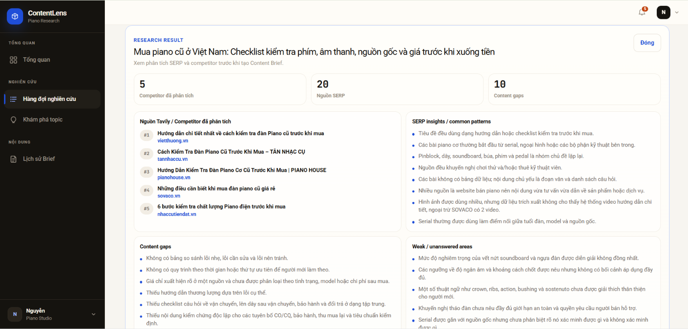
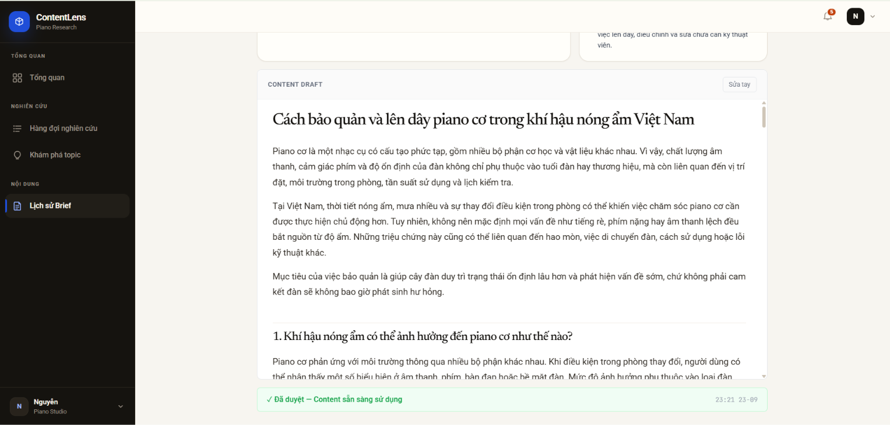
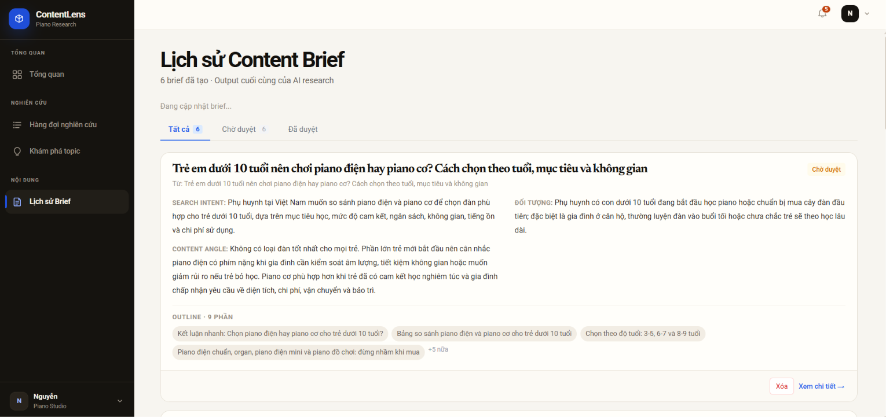
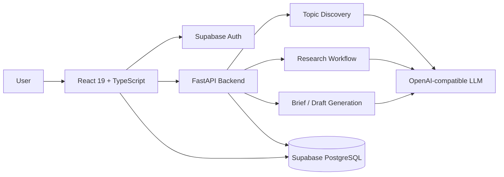
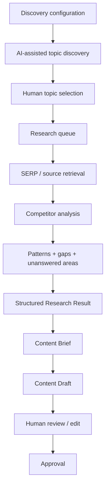

<div align="center">

# ContentLens

### AI-assisted SEO/AIO research workspace for evidence-driven content planning

Discover content opportunities, analyze competing search results, identify information gaps, and turn research into human-reviewed content briefs and drafts.

<p>
  
  
  
  
  
</p>

**[Demo](https://drive.google.com/drive/folders/11sx2jWk7sH3EBIN4rcDjZQgLVEKhUJpt?usp=sharing)** ·
**[Workflow](#how-it-works)** ·
**[Evaluation](#evaluation)** ·
**[Architecture](#system-architecture)** ·
**[Getting Started](#getting-started)**

</div>

<p align="center">
  
</p>

## Overview

**ContentLens** is a full-stack AI research workspace for SEO/AIO content planning.

Instead of sending a keyword directly to an LLM and generating an article immediately, ContentLens separates the process into:

```text
Topic Discovery
      ↓
Human Topic Selection
      ↓
SERP / Competitor Research
      ↓
Content Gap Analysis
      ↓
Content Brief
      ↓
Content Draft
      ↓
Human Review & Approval
```

The current prototype is tested primarily on **Vietnamese piano-related topics**, while the workflow is designed to be reusable across other domains and markets.

> **Research first, generate later.**

The system is designed as a **human-in-the-loop workflow**: AI assists with discovery, research, synthesis, and drafting, while users retain control over topic selection, review, editing, approval, and publishing.

## Key Features

<table>
<tr>
<td width="50%" valign="top">

### Research

- Repeated AI-assisted topic discovery
- Configurable domain, market, time window, and suggestion count
- AI-estimated Search Signals, Content Gap, and Business Relevance
- Research queue with progress and status tracking
- SERP/source collection and competitor analysis
- Common-pattern and content-gap extraction
- Weak-area and unanswered-question detection
- Information-gain and differentiation suggestions

</td>
<td width="50%" valign="top">

### Content workflow

- Structured Research Results before generation
- Research-driven Content Brief generation
- Search intent and target-audience definition
- Content-angle and outline generation
- First-draft generation from approved context
- Manual editing and approval before final use
- Content Brief history
- Supabase authentication and persistent workspaces

</td>
</tr>
</table>

## How It Works

### 1. Discover and select topics

Users configure a discovery request with:

- domain;
- target market;
- time window;
- number of suggestions.

The discovery workflow can be run repeatedly, allowing users to continue finding new opportunities rather than relying on one fixed topic list.

Each suggestion can include AI-estimated:

- **Search Signals**
- **Content Gap**
- **Business Relevance**
- **Content Angle**
- **Opportunity Score**

<p align="center">
  
</p>

> Topic scores are used to prioritize which ideas should move into deeper research.

### 2. Research competing content

Selected topics are moved into the research queue, where users can monitor status and open completed analyses.

<p align="center">
  
</p>

A completed research job aggregates retrieved search sources and produces structured findings such as:

- competitor coverage;
- recurring content patterns;
- content gaps;
- weak or incomplete explanations;
- unanswered questions;
- information-gain opportunities;
- recommended differentiation strategy.

<p align="center">
  
</p>

### 3. Generate a research-driven brief

The research result is converted into a structured Content Brief containing information such as:

- search intent;
- target audience;
- content angle;
- recommended sections;
- important questions to answer;
- research gaps to cover.

### 4. Generate, review, and approve a draft

The approved research context and brief are used to create the first draft.

The draft is **not automatically published**. Users can inspect, edit, and approve the content before final use.

<p align="center">
  
</p>

<details>
<summary><b>View Content Brief history</b></summary>
<br>



</details>

## System Architecture



### Research flow



## Evaluation

ContentLens is evaluated using observable workflow metrics that reflect response speed, research coverage, workflow behavior, and user control.

### Current prototype snapshot

| Metric | Current observation |
|---|---:|
| Typical AI-assisted workflow response | **< 60 seconds** |
| SERP sources in representative research case | **20** |
| Competitors analyzed in representative case | **5** |
| Content gaps extracted in representative case | **10** |
| Topic scoring scale | **0–100** |
| Visible opportunity-score range in current demo queue | **75–88 / 100** |
| Repeated topic discovery | **Supported** |
| Human review before final use | **Required** |
| Automatic publishing | **No** |

The values above are based on the current prototype and demonstrated workflow.

### Notes on current measurements

The metrics above describe the current prototype and demonstrated workflow. They are intended to make the system behavior and research coverage easier to understand and compare during development.

## Technology Stack

| Layer | Technologies |
|---|---|
| Frontend | React 19, TypeScript, Vite 8, Tailwind CSS 4, Recharts |
| Backend | Python, FastAPI, Pydantic, Uvicorn |
| AI | OpenAI-compatible model provider |
| Data | Supabase Auth, PostgreSQL, Supabase JS |
| Infrastructure | Vercel, Railway, Supabase |
| Package management | pnpm |

## Project Structure

```text
ContentLens/
├── frontend/
│   ├── src/
│   ├── package.json
│   ├── tsconfig.json
│   └── vite.config.ts
│
├── backend/
│   ├── app/
│   │   ├── ai/
│   │   ├── api/
│   │   ├── integrations/
│   │   ├── repositories/
│   │   ├── schemas/
│   │   └── workflows/
│   ├── tests/
│   └── pyproject.toml
│
├── supabase/
│   ├── migrations/
│   ├── seed.sql
│   └── config.toml
│
├── images/
│   └── screenshots/
│
├── package.json
├── pnpm-workspace.yaml
├── pnpm-lock.yaml
└── README.md
```

## Engineering Highlights

- Built an end-to-end AI research workflow rather than an isolated text-generation demo.
- Split discovery, research, synthesis, brief generation, and draft generation into task-specific stages.
- Exposed intermediate research results before final content generation.
- Kept high-impact editorial decisions human-controlled.
- Separated frontend, backend, authentication, persistence, and model-provider responsibilities.
- Designed topic discovery to support repeated research rather than a one-time generated list.

## Getting Started

### Prerequisites

- Node.js
- pnpm
- Python
- Supabase CLI
- A Supabase project or local Supabase environment
- An OpenAI-compatible API endpoint and API key

### 1. Clone the repository

```bash
git clone https://github.com/vanujiash9/Contentlens.git
cd Contentlens
```

### 2. Install dependencies

```bash
pnpm install
```

### 3. Configure environment files

Frontend:

```text
frontend/.env.example
→ frontend/.env.local
```

Backend:

```text
backend/.env.example
→ backend/.env
```

Keep model-provider keys and other server-side secrets out of `VITE_*` variables.

### 4. Start local Supabase

```bash
pnpm run db:start
pnpm run db:reset
pnpm run types:db
```

### 5. Start the backend

```bash
pnpm run dev:backend
```

Default backend URL:

```text
http://localhost:8000
```

### 6. Start the frontend

```bash
pnpm run dev
```

Default frontend URL:

```text
http://localhost:8443
```

## Roadmap

- Improve source-quality ranking and filtering
- Add evidence/citation tracking for generated insights
- Add deeper search-intent analysis and topic clustering
- Track latency, token usage, retries, and structured-output failures
- Connect published content with Search Console performance
- Add post-publication feedback for content refresh
- Evaluate the workflow across additional industries and markets

## Author

Developed by [vanujiash9](https://github.com/vanujiash9).

---

<p align="center">
  Built as an end-to-end AI engineering project combining research workflows, human review, structured backend services, persistent data, and production deployment.
</p>
