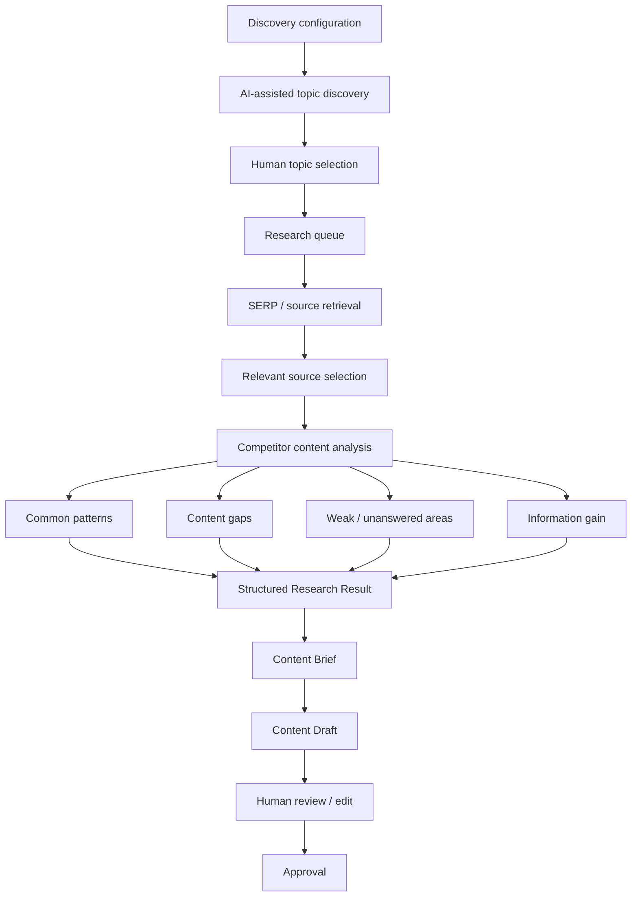
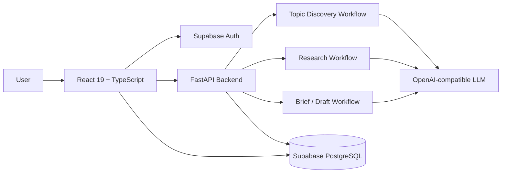

<div align="center">

# ContentLens

### AI-assisted SEO/AIO research workspace for evidence-driven content planning

Discover content opportunities, analyze competing search results, identify information gaps, and turn research into human-reviewed content briefs and drafts.

<p>
  
  
  
  
  
</p>

**[Demo](https://drive.google.com/drive/folders/11sx2jWk7sH3EBIN4rcDjZQgLVEKhUJpt?usp=sharing)** ·
**[Evaluation](#evaluation)** ·
**[Architecture](#system-architecture)** ·
**[Getting Started](#getting-started)**

</div>

<p align="center">
  
</p>

## Overview

**ContentLens** is a full-stack research workspace for SEO/AIO content teams. It is designed around a simple principle:

> **Research first, generate later.**

Instead of sending a keyword directly to an LLM and asking for an article, ContentLens separates the workflow into topic discovery, SERP/source research, competitor analysis, gap detection, brief generation, draft generation, and human approval.

The current prototype is tested primarily on **Vietnamese piano-related topics**, while the workflow is designed to be reusable across other domains and markets.

## Why ContentLens?

A useful content workflow requires more than text generation. Before writing, a researcher normally needs to:

- discover relevant topic opportunities;
- inspect competing search results;
- compare what competitors repeatedly cover;
- identify weak explanations and unanswered questions;
- find opportunities for additional information gain;
- define search intent, audience, and content angle;
- build a structured brief;
- review the final draft before publication.

ContentLens brings these steps into one research pipeline and keeps the user in control of editorial decisions.

## Key Features

<table>
<tr>
<td width="50%" valign="top">

### Research & discovery

- Repeated AI-assisted topic discovery.
- Configurable domain, market, time window, and suggestion count.
- AI-estimated **Search Signals**, **Content Gap**, and **Business Relevance** scores.
- Research queue with filtering, progress states, and retry actions.
- SERP/source collection and competitor analysis.
- Common-pattern, content-gap, weak-area, and unanswered-question extraction.
- Information-gain and recommended-angle analysis.

</td>
<td width="50%" valign="top">

### Content workflow

- Structured Research Result before generation.
- Research-driven Content Brief generation.
- Search intent and target-audience definition.
- Content-angle and outline generation.
- First-draft generation from approved research context.
- Manual editing and approval before final use.
- Content Brief history and workflow dashboard.
- Supabase authentication and persistent workspaces.

</td>
</tr>
</table>

## Human-in-the-Loop Workflow

ContentLens is intentionally **not a fully autonomous publishing agent**.

The AI assists with research and generation, while the user keeps control over the decisions that can materially affect the final content.

| Stage | AI | User |
|---|:---:|:---:|
| Suggest topic opportunities | ✓ | |
| Estimate topic signals | ✓ | |
| Select topics for research | | ✓ |
| Collect and analyze sources | ✓ | |
| Review Research Result | | ✓ |
| Generate Content Brief | ✓ | |
| Review / edit Content Brief | | ✓ |
| Generate first Content Draft | ✓ | |
| Edit final content | | ✓ |
| Approve final output | | ✓ |
| Publish content | | ✓ |

This design prevents the application from treating model-generated recommendations as unquestioned editorial decisions.

## Topic Discovery

Users configure a discovery request with:

- **Domain**
- **Target market**
- **Time window**
- **Number of suggestions**

The discovery workflow can be run repeatedly, allowing teams to continue finding new topics instead of relying on a single fixed batch.

Each suggestion can include:

- **Search Signals**
- **Content Gap**
- **Business Relevance**
- **Suggested content angle**
- **Opportunity score**

<p align="center">
  
</p>

> **Important:** topic scores are AI-assisted prioritization estimates. They are not verified keyword-search volume, ranking probability, CTR, or revenue forecasts.

## Research Queue

Selected topics are moved into a research queue where users can track their state and inspect completed research.

The queue exposes:

- workflow status;
- research progress;
- opportunity score;
- creation time;
- research actions;
- links to Research Results and Content Briefs.

<p align="center">
  
</p>

## Research Result

A completed research job aggregates retrieved search sources and produces a structured analysis before any final draft is created.

A representative case from the current prototype shows:

| Research output | Observed example |
|---|---:|
| SERP sources collected | **20** |
| Competitors analyzed in detail | **5** |
| Content gaps identified | **10** |
| Topic / opportunity score scale | **0–100** |
| Opportunity scores visible in the current demo queue | **75–88 / 100** |

The Research Result can include:

- analyzed competitor pages;
- common SERP/content patterns;
- content gaps;
- weak or incomplete explanations;
- unanswered questions;
- information-gain opportunities;
- recommended differentiation strategy.

<p align="center">
  
</p>

The counts above are **observed workflow outputs from the demonstrated case**, not fixed limits or guaranteed results for every topic.

## Content Brief & Draft

Research findings are converted into a structured Content Brief before draft generation.

A brief can include:

- search intent;
- target audience;
- content angle;
- recommended sections;
- important questions to answer;
- research gaps to cover;
- research-backed writing direction.

The generated draft remains editable and requires user review before it is marked ready for use.

<p align="center">
  
</p>

<details>
<summary><b>View Content Brief history</b></summary>
<br>


</details>

## Research Pipeline



## AI Workflow

The AI workflow is split into task-specific stages rather than relying on one large prompt.

### 1. Topic Discovery

```text
Domain
+ Market
+ Time Window
+ Suggestion Count
        ↓
AI-assisted discovery
        ↓
Topic
+ Search Signals
+ Content Gap
+ Business Relevance
+ Content Angle
```

### 2. Competitor Research

```text
Topic
  ↓
Search / SERP retrieval
  ↓
Source processing
  ↓
Relevant competitor selection
  ↓
Cross-source comparison
```

### 3. Research Synthesis

The system converts source analysis into structured fields such as:

```text
Common Patterns
Content Gaps
Weak Explanations
Unanswered Questions
Information-Gain Opportunities
Recommended Advantage
```

### 4. Brief & Draft Generation

```text
Research Result
      ↓
Structured Content Brief
      ↓
Human review
      ↓
Content Draft
      ↓
Edit / approve
```

## System Architecture



The repository is organized as a small monorepo: the Vite/React frontend lives in `frontend/`, the FastAPI backend in `backend/`, and Supabase schema/migrations in `supabase/`.

## Evaluation

ContentLens is a research-and-generation system, so a single supervised-learning metric such as accuracy or F1-score does not fully describe its behavior.

The current prototype is evaluated more transparently across **latency, research coverage, structured output, user control, and known limitations**.

### Current prototype snapshot

| Metric | Current observation |
|---|---:|
| Typical AI-assisted workflow response | **< 60 seconds** |
| SERP sources in representative research case | **20** |
| Competitors analyzed in representative case | **5** |
| Content gaps extracted in representative case | **10** |
| Topic scoring scale | **0–100** |
| Visible opportunity-score range in current queue | **75–88 / 100** |
| Repeated topic discovery | **Supported** |
| Human review before final use | **Required** |
| Automatic publishing | **No** |

### Latency

In current testing, an AI-assisted operation typically completes in **under one minute**.

This is an observed prototype-level result, **not a strict SLA**. Actual latency depends on:

- search-provider response time;
- number and length of retrieved sources;
- LLM-provider latency;
- network conditions;
- retry behavior.

### Evaluation boundaries

The prototype does **not** claim that:

- generated content will automatically rank on Google;
- ContentLens guarantees inclusion in AI Overviews;
- a higher AI-estimated topic score guarantees more traffic;
- generated drafts always outperform competing pages;
- grounding completely eliminates hallucinations.

Those outcomes require longitudinal evaluation using published content and real search-performance data.

### Planned evaluation

Future evaluation can measure:

| Metric | What it measures |
|---|---|
| Source relevance | Whether retrieved sources match the research intent |
| Research coverage | Whether important subtopics are captured |
| Gap validity | Whether reported gaps are genuinely missing or weak |
| Search-intent alignment | Whether the brief addresses the intended query |
| Groundedness | Whether generated claims are supported by research context |
| Human acceptance rate | Percentage of outputs accepted with minor/no edits |
| Hallucination rate | Unsupported or fabricated claims |
| End-to-end latency | Research and generation response time |

After enough content is published, the system can also be evaluated with production metrics such as Search Console impressions, clicks, average position, query coverage, organic traffic, and content-revision frequency.

## Technology Stack

| Layer | Technologies |
|---|---|
| Frontend | React 19, TypeScript, Vite 8, Tailwind CSS 4, Recharts |
| Backend | Python, FastAPI, Pydantic, Uvicorn |
| AI | OpenAI-compatible model provider |
| Data | Supabase Auth, PostgreSQL, Supabase JS |
| Infrastructure | Vercel, Railway, Supabase |
| Package management | pnpm |

## Project Structure

```text
ContentLens/
├── frontend/
│   ├── src/
│   ├── package.json
│   ├── tsconfig.json
│   └── vite.config.ts
│
├── backend/
│   ├── app/
│   │   ├── ai/
│   │   ├── api/
│   │   ├── integrations/
│   │   ├── repositories/
│   │   ├── schemas/
│   │   └── workflows/
│   ├── tests/
│   └── pyproject.toml
│
├── supabase/
│   ├── migrations/
│   ├── seed.sql
│   └── config.toml
│
├── docs/
│   └── screenshots/
│
├── package.json
├── pnpm-workspace.yaml
├── pnpm-lock.yaml
└── README.md
```

## Getting Started

### Prerequisites

- Node.js
- pnpm
- Python
- Supabase CLI
- A Supabase project or local Supabase environment
- An OpenAI-compatible API endpoint and API key

### 1. Clone the repository

```bash
git clone https://github.com/vanujiash9/ContentLens.git
cd ContentLens
```

### 2. Install workspace dependencies

```bash
pnpm install
```

### 3. Configure environment files

Frontend:

```text
frontend/.env.example
→ frontend/.env.local
```

Backend:

```text
backend/.env.example
→ backend/.env
```

Only browser-safe `VITE_*` values should be placed in the frontend environment.

Backend-only secrets such as service-role keys and model-provider API keys must remain on the server.

### 4. Start local Supabase

```bash
pnpm run db:start
```

Reset the database and apply migrations / seed data:

```bash
pnpm run db:reset
```

Generate frontend database types:

```bash
pnpm run types:db
```

### 5. Start the backend

```bash
pnpm run dev:backend
```

Default backend URL:

```text
http://localhost:8000
```

### 6. Start the frontend

```bash
pnpm run dev
```

Default frontend URL:

```text
http://localhost:8443
```

## Demo

A recorded demonstration of the current workflow is available here:

**[ContentLens Demo — Google Drive](https://drive.google.com/drive/folders/11sx2jWk7sH3EBIN4rcDjZQgLVEKhUJpt?usp=sharing)**

The demo covers topic discovery, research queue management, competitor/SERP analysis, Content Brief creation, and draft review.

## Engineering Highlights

- Built an end-to-end AI research workflow instead of an isolated text-generation demo.
- Separated topic discovery, competitor research, research synthesis, brief generation, and draft generation into task-specific stages.
- Exposed intermediate research results so users can inspect the reasoning inputs before accepting generated content.
- Kept high-impact editorial decisions human-controlled.
- Used structured backend schemas and API boundaries for frontend/AI integration.
- Separated frontend, backend, authentication, persistence, and model-provider responsibilities.
- Kept server-side credentials out of the browser.
- Designed topic discovery to be repeatable rather than limited to a one-time generated list.
- Added persistent research states, brief history, and approval-oriented workflow states.

## Limitations

### AI-estimated scores

Search Signals, Content Gap, Business Relevance, and opportunity scores are model-assisted estimates for prioritization.

They are not direct Google keyword-volume measurements or guaranteed performance indicators.

### Source dependency

Research quality depends on the relevance and quality of the retrieved sources. Weak source retrieval can reduce the quality of downstream analysis.

### LLM variability

The same topic can produce somewhat different summaries, gaps, or recommendations across runs.

### Hallucination risk

Research grounding reduces but does not eliminate unsupported claims. Human verification remains necessary.

### SEO impact is not yet validated

The current prototype evaluates the workflow itself. Long-term ranking or traffic improvements require real publishing experiments and longitudinal search data.

### Domain scope

Current testing focuses primarily on piano-related content for the Vietnamese market. Cross-domain performance has not yet been systematically benchmarked.

## Roadmap

- Add stronger source-quality ranking and filtering.
- Track evidence/citations for individual generated insights.
- Add deeper search-intent analysis.
- Add topic clustering and content-cannibalization checks.
- Compare new content against existing site content before generation.
- Add structured human-evaluation datasets for research quality.
- Track latency, token usage, retries, and structured-output failures.
- Connect published content to Search Console performance.
- Add a post-publication feedback loop for content refresh.
- Extend evaluation to additional industries and markets.

## Author

Developed by [vanujiash9](https://github.com/vanujiash9).

---

<p align="center">
  Built as an end-to-end AI engineering project: research workflow, human-in-the-loop review, full-stack product UI, structured backend services, persistent data, and production deployment.
</p>
