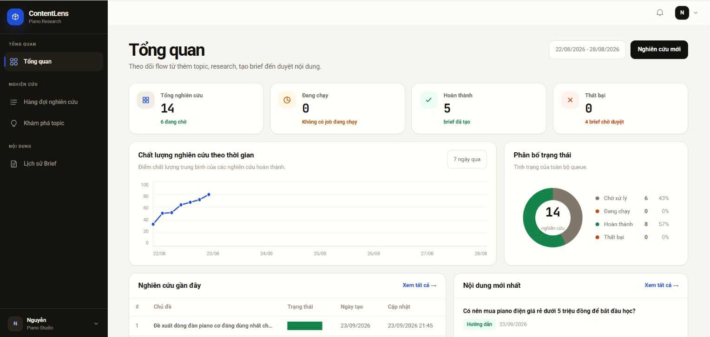
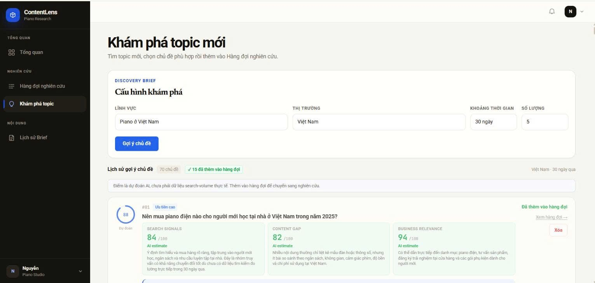
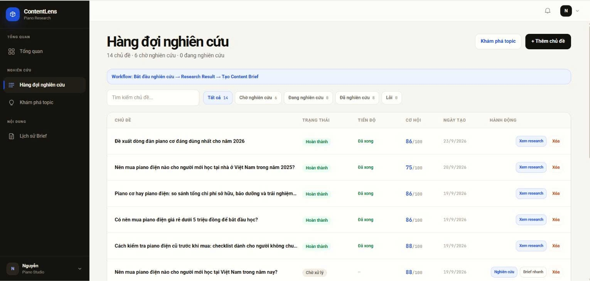
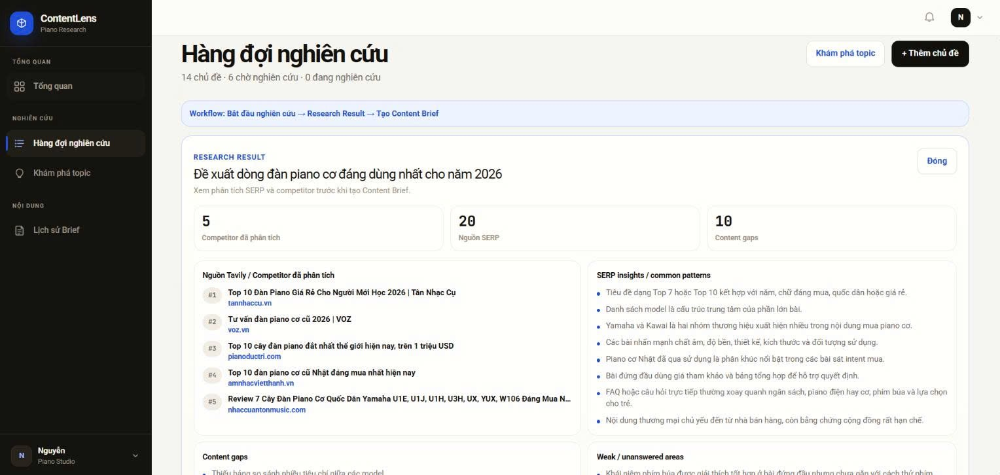
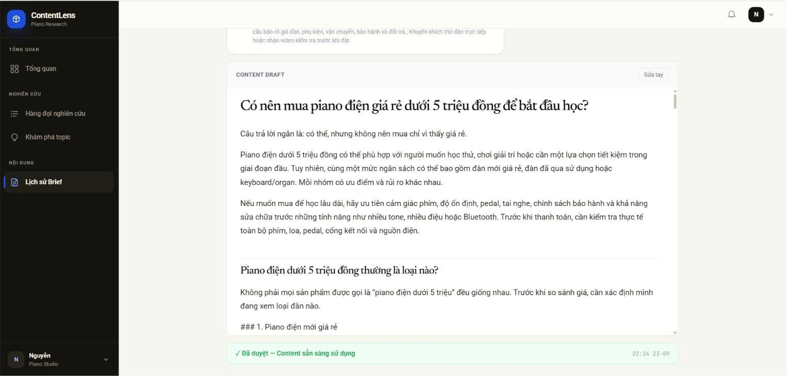

# ContentLens

### AI-powered SEO/AIO research system for topic discovery, competitor analysis, content-gap detection, and research-driven content generation

ContentLens is an end-to-end AI-assisted content research workspace designed to help teams move from **topic discovery** to **evidence-backed content output** without handing the entire decision process to AI.

The current implementation is tested on the **Vietnamese piano market** and combines topic ideation, SERP/competitor research, content-gap analysis, content brief generation, drafting, and human review in one workflow.

> **Core principle:** Research first, generate later.

**Demo video:** [Google Drive](https://drive.google.com/drive/folders/11sx2jWk7sH3EBIN4rcDjZQgLVEKhUJpt?usp=sharing)

---

## Overview

A common AI-content workflow starts with a keyword and immediately asks an LLM to write an article. ContentLens uses a different approach: the system first gathers research signals, compares competitor content, identifies missing information, and only then generates a brief and draft.

```text
Topic Discovery
      ↓
Human Selection
      ↓
Research Queue
      ↓
SERP / Competitor Research
      ↓
Cross-source Analysis
      ↓
Content Gaps & Opportunities
      ↓
Content Brief
      ↓
Content Draft
      ↓
Human Review & Approval
```

The user remains in control at key checkpoints. AI can continuously propose new topics and generate research outputs, but the system does **not** automatically publish or treat AI scores as ground truth.

---

## Problem

Researching SEO/AIO content manually requires repeated work:

- Finding topics worth investigating
- Searching for relevant competitor pages
- Reading multiple articles
- Comparing common coverage patterns
- Detecting missing or weakly answered questions
- Choosing a differentiated content angle
- Building a structured brief
- Drafting the article
- Reviewing the final output before use

This process becomes slow and inconsistent as the number of topics grows.

ContentLens centralizes these steps into a structured AI-assisted workflow while preserving human review at important decision points.

---

## Product Demo

### 1. Dashboard

The dashboard provides a high-level view of the research pipeline, including queue state, completed research, failed jobs, recent work, and research-quality trends.

<p align="center">
  
</p>

---

### 2. Continuous Topic Discovery

Users configure the discovery context using:

- Domain
- Target market
- Time range
- Number of requested suggestions

The AI can generate **new topic batches repeatedly**, allowing the user to continue exploring instead of being limited to a one-time suggestion list.

Each topic is evaluated using three AI-estimated dimensions:

- **Search Signals**
- **Content Gap**
- **Business Relevance**

The system also proposes a content angle before the user decides whether a topic should enter the research queue.

> These scores are **AI estimates**, not measured search-volume data. They are intended as prioritization signals rather than factual traffic forecasts.

<p align="center">
  
</p>

---

### 3. Research Queue

Selected topics are moved into a research queue where users can track status, progress, opportunity score, creation time, and available actions.

A topic is not researched or approved simply because the AI suggested it. The user explicitly chooses which topics should continue through the pipeline.

<p align="center">
  
</p>

---

### 4. Research Result

For each researched topic, ContentLens aggregates SERP/competitor evidence and produces structured findings such as:

- Analyzed competitor pages
- SERP sources
- Common content patterns
- Content gaps
- Weak or unanswered areas
- Potential information-gain opportunities
- Recommended differentiation direction

In the demo example shown below, the research result contains:

- **5 competitor pages analyzed**
- **20 SERP sources collected**
- **10 content gaps identified**

<p align="center">
  
</p>

---

### 5. Content Brief & Draft

Research findings are transformed into a structured content brief and then used as context for draft generation.

The workflow remains **human-in-the-loop**:

1. AI produces the research result.
2. The user reviews the evidence and proposed direction.
3. A content brief is created.
4. AI generates a draft from the approved research context.
5. The user reviews, edits, and approves the output before it is considered ready to use.

<p align="center">
  
</p>

---

## Current Evaluation Snapshot

The values below describe the **current demo / pilot implementation**, not a universal benchmark. Results can vary with topic complexity, model provider, network latency, and source availability.

| Metric | Current observation | How it should be interpreted |
|---|---:|---|
| Typical AI-assisted response time | **< 60 seconds** | Developer-observed in the current demo environment; not a hard SLA |
| Competitor pages analyzed in the shown research example | **5** | Final subset selected for deeper competitor analysis |
| SERP sources in the shown research example | **20** | Candidate/reference sources collected for the topic |
| Content gaps found in the shown research example | **10** | AI-extracted gaps requiring human review |
| Example research opportunity scores | **75–88 / 100** | Prioritization score shown in the queue, not a traffic guarantee |
| Example topic discovery score | **88 / 100** | Composite AI estimate in the current demo |
| Example discovery sub-scores | **84 Search Signals / 82 Content Gap / 94 Business Relevance** | AI estimates used to help prioritize a topic |
| Human approval before final use | **Required** | AI output is reviewed before approval; there is no automatic publishing flow |
| Topic exploration mode | **Repeatable / continuous** | Users can request additional topic batches instead of relying on a single generation |

### Transparency Notes

- Topic scores are **model-generated estimates** and are not presented as real search volume.
- Research findings are derived from retrieved sources but still require human verification.
- A high opportunity score does not guarantee ranking, traffic, conversion, or business impact.
- Content generation is intentionally separated from approval.
- The product is designed to **support decisions**, not replace the user's judgment.
- Current evaluation is based on the demo workflow and qualitative inspection of outputs; a larger labeled benchmark is not yet claimed.

---

## Key Features

- AI-assisted topic discovery
- Repeatable topic generation for continuous exploration
- Topic prioritization using Search Signals, Content Gap, and Business Relevance
- Human-controlled research queue
- SERP and competitor source collection
- Cross-source competitor analysis
- Common-pattern extraction
- Content-gap identification
- Weak / unanswered-area detection
- Information-gain opportunity analysis
- Structured research results
- Content Brief generation
- Research-grounded Content Draft generation
- Manual review and approval workflow
- Research history and status tracking
- Dashboard for pipeline monitoring
- Authentication and persistent workspace data

---

## AI Research Pipeline

```text
┌─────────────────────┐
│   Discovery Input   │
│ Domain / Market /   │
│ Time Range          │
└──────────┬──────────┘
           │
           ▼
┌─────────────────────┐
│  Topic Discovery AI │
└──────────┬──────────┘
           │
           ▼
┌─────────────────────┐
│    Human Review     │
│  Add to queue?      │
└──────────┬──────────┘
           │
           ▼
┌─────────────────────┐
│    SERP Research    │
└──────────┬──────────┘
           │
           ▼
┌─────────────────────┐
│ Source Extraction & │
│ Competitor Analysis │
└──────────┬──────────┘
           │
           ├───────────────┐
           ▼               ▼
   Common Patterns    Content Gaps
           │               │
           ├───────────────┤
           ▼               ▼
 Weak / Unanswered   Information Gain
           │               │
           └───────┬───────┘
                   ▼
          ┌─────────────────┐
          │ Research Result │
          └────────┬────────┘
                   ▼
          ┌─────────────────┐
          │  Human Review   │
          └────────┬────────┘
                   ▼
          ┌─────────────────┐
          │  Content Brief  │
          └────────┬────────┘
                   ▼
          ┌─────────────────┐
          │  Content Draft  │
          └────────┬────────┘
                   ▼
          ┌─────────────────┐
          │ Review / Approve│
          └─────────────────┘
```

---

## Human-in-the-Loop Design

ContentLens intentionally avoids a fully autonomous publishing flow.

Human checkpoints are built into the process:

### Topic Selection

AI suggests potential topics, but the user chooses which topics enter the research queue.

### Research Review

Competitor findings, content gaps, and recommended angles can be inspected before a brief is generated.

### Brief Review

The user can check whether the proposed search intent, audience, content angle, and outline match the intended strategy.

### Final Content Approval

Generated content remains editable and requires approval before it is treated as ready for use.

This design reduces the risk of treating LLM output as unquestioned factual or strategic truth.

---

## System Architecture

```text
                        ┌───────────────────┐
                        │       User        │
                        └─────────┬─────────┘
                                  │
                                  ▼
                        ┌───────────────────┐
                        │  React Frontend   │
                        │ TypeScript + Vite │
                        └─────────┬─────────┘
                                  │
                               REST API
                                  │
                                  ▼
                        ┌───────────────────┐
                        │  FastAPI Backend  │
                        └─────────┬─────────┘
                                  │
                   ┌──────────────┼──────────────┐
                   │              │              │
                   ▼              ▼              ▼
            Topic Discovery    Research      Content Brief
               Workflow        Workflow        Workflow
                   │              │              │
                   └──────────────┼──────────────┘
                                  │
                                  ▼
                        ┌───────────────────┐
                        │   AI Provider /   │
                        │       LLM         │
                        └───────────────────┘
                                  │
                                  ▼
                        ┌───────────────────┐
                        │     Supabase      │
                        │ PostgreSQL + Auth │
                        └───────────────────┘
```

### Production Deployment

```text
React + Vite  ──────► Vercel
                         │
                         ▼
FastAPI      ──────► Railway
                         │
                         ▼
PostgreSQL   ──────► Supabase
Authentication ────► Supabase Auth
```

---

## Tech Stack

### Frontend

| Technology | Purpose |
|---|---|
| React | User interface |
| TypeScript | Type-safe frontend development |
| Vite | Frontend build tooling |
| Tailwind CSS | Styling |
| Recharts | Dashboard visualization |
| Supabase JS | Authentication / client integration |

### Backend

| Technology | Purpose |
|---|---|
| Python | Backend and AI workflow implementation |
| FastAPI | REST API |
| Pydantic | Request / response validation and structured data |
| Uvicorn | ASGI server |
| OpenAI-compatible provider layer | LLM integration |

### Data & Deployment

| Technology | Purpose |
|---|---|
| Supabase / PostgreSQL | Persistent application data |
| Supabase Auth | Authentication |
| Vercel | Frontend deployment |
| Railway | Backend deployment |

---

## Project Structure

```text
Contentlens/
│
├── frontend/
│   ├── src/
│   ├── package.json
│   ├── tsconfig.json
│   └── vite.config.ts
│
├── backend/
│   ├── app/
│   │   ├── ai/
│   │   ├── api/
│   │   ├── integrations/
│   │   ├── repositories/
│   │   ├── schemas/
│   │   └── workflows/
│   ├── tests/
│   └── pyproject.toml
│
├── supabase/
│   ├── migrations/
│   ├── seed.sql
│   └── config.toml
│
├── package.json
├── pnpm-workspace.yaml
├── pnpm-lock.yaml
└── README.md
```

---

## Getting Started

### 1. Clone the repository

```bash
git clone https://github.com/vanujiash9/Contentlens.git
cd Contentlens
```

### 2. Install dependencies

```bash
pnpm install
```

### 3. Configure environment variables

Create the frontend environment file:

```text
frontend/.env.example
        ↓
frontend/.env.local
```

Create the backend environment file:

```text
backend/.env.example
        ↓
backend/.env
```

Do not expose server-side secrets such as service-role keys or LLM API keys in frontend environment variables.

---

## Running Locally

### Start Supabase

```bash
pnpm run db:start
```

Reset the local database:

```bash
pnpm run db:reset
```

Generate database types:

```bash
pnpm run types:db
```

### Start Backend

```bash
pnpm run dev:backend
```

Default backend URL:

```text
http://localhost:8000
```

### Start Frontend

```bash
pnpm run dev
```

Default frontend URL:

```text
http://localhost:8443
```

---

## Build

```bash
pnpm run build
```

---

## Limitations

The current version still has several limitations:

- AI discovery scores are estimates rather than direct keyword-search-volume measurements.
- Research quality depends on the relevance and accessibility of retrieved sources.
- LLM-generated insights can still contain incorrect interpretations and should be reviewed.
- The current evaluation is based on pilot/demo usage rather than a large labeled benchmark.
- Response time depends on model latency, network conditions, and research workload.
- Current testing is focused primarily on the Vietnamese piano domain, so cross-domain generalization has not yet been fully evaluated.
- The system does not claim that generated content will automatically rank in Google Search or appear in AI-generated search answers.

---

## Roadmap

- More robust SERP retrieval and source filtering
- Source-level evidence / citation tracking for individual insights
- Search-intent classification improvements
- Topic clustering
- Existing-site content comparison
- Duplicate / cannibalization detection
- Content quality evaluation before approval
- Post-publication ranking and traffic feedback loop
- Performance-based topic prioritization
- CMS integration
- Additional domains beyond piano
- Larger evaluation set with human-labeled research quality metrics

---

## Project Goal

ContentLens is built around one idea:

> **Do not ask AI to write first. Research first, identify what already exists and what is still missing, then generate content with human oversight.**

The goal is not to replace the content strategist or business owner. It is to reduce repetitive research work while keeping important decisions reviewable and controllable by the user.

---

## Author

**Bui Thi Thanh Van**  
GitHub: [@vanujiash9](https://github.com/vanujiash9)
